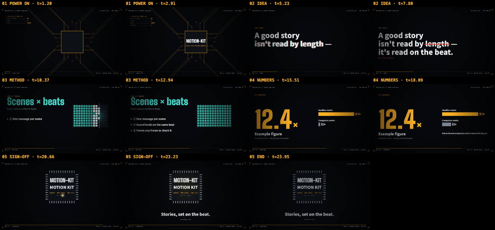
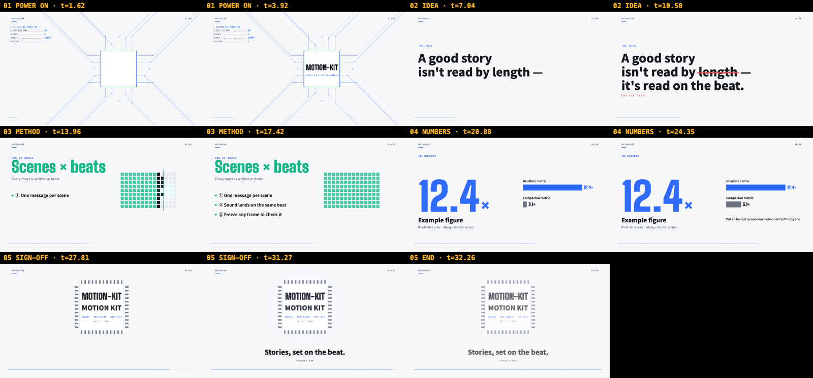
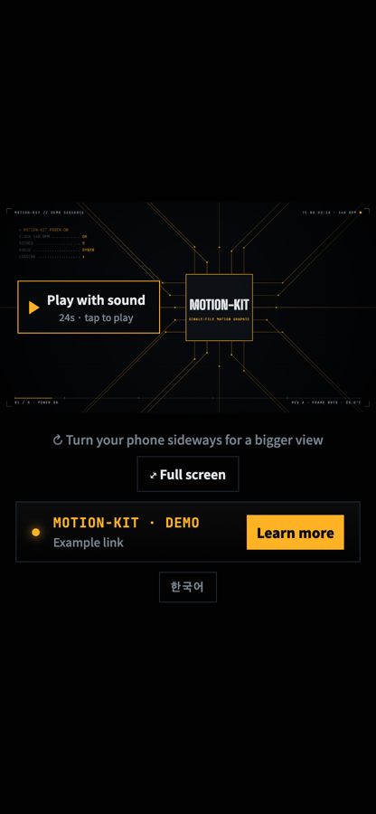
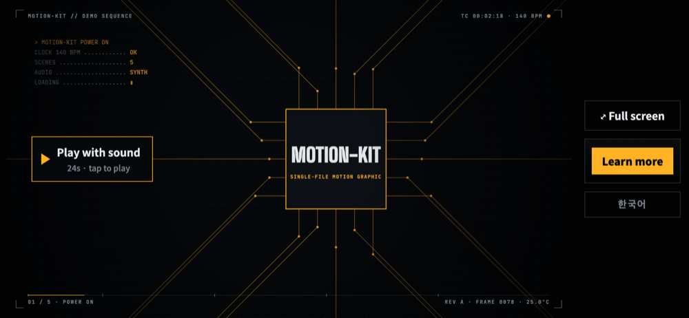

# motion-graphic

**Hand Codex or Claude a brief. Get a motion graphic in one HTML file.**

A [Codex](https://developers.openai.com/codex/) and [Claude Code](https://claude.com/claude-code) skill that turns a brief and reference material — docs, PDFs, numbers, screenshots, URLs — into a beat-synced, 1920×1080 canvas motion graphic with synthesized music, a scrubbable player that works on phones, and automated visual checks.

**English** · [한국어](README.ko.md)

[](LICENSE) [](skills/motion-graphic/SKILL.md) [](skills/motion-graphic/agents/openai.yaml) [](CHANGELOG.md)



*The bundled demo (24 s, 5 scenes), two stills per scene — generated by the skill's own verification script.*

## Samples

Four motion graphics made with this skill using Claude Code and Codex. The videos below are recorded from the HTML with [`record.js`](skills/motion-graphic/scripts/record.js) (sound on 🔊); the ▶ links open the interactive HTML itself. Each folder in [`samples/`](samples) also keeps the sourced `facts.md` and the `storyboard.md` the agent wrote.

### Skill intro — flat pop · 30 s

https://github.com/user-attachments/assets/be0d6871-4e56-49c0-91d5-90b77d540cf2

[▶ Play live](https://jakeb-5.github.io/motion-graphic-skill/samples/skill-intro/) ([한국어](https://jakeb-5.github.io/motion-graphic-skill/samples/skill-intro/?lang=ko)) · [source](samples/skill-intro) · 7 scenes, electro groove at 128 BPM

<details>
<summary>Prompt</summary>

```text
Make a 30-second motion graphic that introduces this repository's motion-graphic skill to developers browsing GitHub. Use the README, SKILL.md and CHANGELOG in this repo as the source material. Bold, playful flat-pop look — not the default dark console. English and Korean. End with a link to https://github.com/JakeB-5/motion-graphic-skill.
```

</details>

### James Webb Space Telescope — night-sky planetarium · 45 s

https://github.com/user-attachments/assets/03088c20-9c28-4d23-9669-7edb0c5e0aeb

[▶ Play live](https://jakeb-5.github.io/motion-graphic-skill/samples/webb-telescope/) ([한국어](https://jakeb-5.github.io/motion-graphic-skill/samples/webb-telescope/?lang=ko)) · [source](samples/webb-telescope) · 8 scenes, drum-less pulse groove at 90 BPM, every number sourced to NASA

<details>
<summary>Prompt</summary>

```text
Make a 45-second explainer motion graphic about the James Webb Space Telescope for a general audience — it will loop on a science-museum lobby screen. Take every number from NASA's public Webb pages (https://science.nasa.gov/mission/webb/). English and Korean. End with a link to https://science.nasa.gov/mission/webb/.
```

</details>

### V60 pour-over guide — warm café illustration · 31 s

https://github.com/user-attachments/assets/bba61e37-23db-41b9-89be-78fe5fbb94a8

[▶ Play live](https://jakeb-5.github.io/motion-graphic-skill/samples/pour-over/) ([한국어](https://jakeb-5.github.io/motion-graphic-skill/samples/pour-over/?lang=ko)) · [source](samples/pour-over) · 7 scenes, soft groove at 124 BPM, recipe from Hario and the SCA

<details>
<summary>Prompt</summary>

```text
Make a 30-second motion graphic that teaches a complete beginner how to brew pour-over coffee with a V60 dripper — friendly and warm, for a small café's in-store screen. Base the recipe numbers on the Specialty Coffee Association's brewing guidance and Hario's V60 instructions. English and Korean. No call-to-action link.
```

</details>

### Codex Motion Studio — paper cards · 30 s

https://github.com/user-attachments/assets/956b8396-94b1-468b-90a3-c0aff0739447

[▶ Play live](https://jakeb-5.github.io/motion-graphic-skill/samples/codex-studio/?lang=en) ([한국어](https://jakeb-5.github.io/motion-graphic-skill/samples/codex-studio/?lang=ko)) · [source](samples/codex-studio) · 7 scenes, electro groove at 128 BPM, made with Codex

<details>
<summary>Prompt</summary>

```text
Make a 30-second motion graphic introducing this repository's motion-graphic skill to developers who use Codex. Use README.md, skills/motion-graphic/SKILL.md and CHANGELOG.md as the source material. Make it feel like a playful graphic-design studio: cream paper, bold typography, and violet, orange and mint cards that become a storyboard, a beat sequencer, an HTML file and a phone. Show how a brief and reference material turn into a motion graphic with synchronized music and a mobile-ready player. Seven scenes, electro groove at 128 BPM. English and Korean, with a language switch in the same HTML. End with Codex support and a link to https://github.com/JakeB-5/motion-graphic-skill.
```

</details>

*The videos show the English version; the ▶ links have a Korean one too.*

## What you get

- **One self-contained HTML file.** No build step, no video, no audio assets. Open it in a browser, drop it on any static host, or attach it.
- **Scenes on the beat.** Every motion is timed in beats at a chosen tempo, and each sound effect lands on the same beat as the motion it belongs to.
- **Music and effects synthesized live** with Web Audio: four grooves (`electro`, `soft`, `pulse`, `none`) plus a palette of effects (slam, scan, riser, stamp, laser, error → correct…).
- **A style that fits the topic.** The agent picks brightness, texture, frame, type, easing, transitions and music from the subject and audience — a dark technical console for a chip maker, clean and light for investor relations, cream paper and serif for a brand story, flat pop for a teaser.
- **A real player.** Click or tap to play, drag the progress bar to scrub, keyboard shortcuts, full screen, a call-to-action button, and an end-frame link that unlocks after one full viewing.
- **Phone-ready.** Portrait stacks the controls under the film; landscape gives the film the full height with a side dock.
- **Honest numbers.** Every on-screen figure is traced to a source in `facts.md`, big metrics get a same-scale companion metric, and rounding stays consistent.
- **Verified before you see it.** A contact sheet of stills, text clipped at the edges, audio levels per scene, 7 device layouts, touch playback, truncated labels.

| Clean style (same scenes, restyled) | Phone portrait | Phone landscape |
|---|---|---|
|  |  |  |

## Install

The same `skills/motion-graphic` folder supports both agents, including the engine, references and scripts.

### Quick install (any agent)

With the [`skills`](https://www.npmjs.com/package/skills) CLI, one command installs the skill for Claude Code, Codex and other supported agents:

```bash
npx skills add JakeB-5/motion-graphic-skill --skill motion-graphic
```

It installs into the current project by default; add `-g` to install for your user instead. The sections below cover the agent-specific alternatives.

### Codex

When you open this repository in Codex, `.agents/skills/motion-graphic` links to the shared skill so it can be discovered locally. To use it in other projects, copy it to your personal skills directory (macOS/Linux/WSL):

```bash
git clone https://github.com/JakeB-5/motion-graphic-skill.git
mkdir -p ~/.agents/skills
cp -R motion-graphic-skill/skills/motion-graphic ~/.agents/skills/
```

If you already cloned the repository, skip `git clone`. For installation in just one other project, use that project's `.agents/skills/` instead of `~/.agents/skills/`. Copy the entire skill folder, including `assets`, `references`, `scripts` and `agents`. Choose one installation scope to avoid duplicate entries. If the skill does not appear, restart Codex. See the [official skill discovery documentation](https://learn.chatgpt.com/docs/build-skills#where-codex-loads-local-skills).

### Claude Code

**As a plugin**:

```text
/plugin marketplace add JakeB-5/motion-graphic-skill
/plugin install motion-graphic@motion-graphic-skill
```

**Or manually** — copy (or symlink) the skill into your skills folder:

```bash
git clone https://github.com/JakeB-5/motion-graphic-skill.git
mkdir -p ~/.claude/skills
cp -R motion-graphic-skill/skills/motion-graphic ~/.claude/skills/
```

### Verification dependencies

**Dependencies** (recommended — the skill uses them to check its own work):

- Python 3 (for `assemble.py`)
- Node.js 18+ and Chrome or Chromium
- `puppeteer-core`, installed once next to the script:

```bash
# Codex personal installation
npm i --prefix ~/.agents/skills/motion-graphic/scripts puppeteer-core@23
# Claude Code manual installation
npm i --prefix ~/.claude/skills/motion-graphic/scripts puppeteer-core@23
```

Run only the command for your installation. For a repository-local skill, use `skills/motion-graphic/scripts` as the prefix from this repository root; for a plugin installation, use the installed skill's `scripts` directory.

Chrome is found automatically on macOS, Linux and Windows; otherwise set `CHROME=/path/to/chrome`.

## Use

In Codex, invoke the skill explicitly with `$motion-graphic`:

```text
$motion-graphic Make a 30-second product intro from README.md, in English and Korean.
```

Both agents can also select the skill automatically for requests like:

```text
Make a 30-second motion graphic introducing our product from README.md and docs/metrics.csv — it opens my lightning talk.
```

```text
여기 포트폴리오 PDF랑 지원 공고 있어. 지원서에 넣을 1분짜리 모션그래픽 만들어줘. 끝에는 PDF 링크.
```

```text
Turn these three case studies into a 15-second intro for our investor update. Keep it calm and corporate.
```

Codex or Claude will ask once for anything essential that's missing (audience, length, link), show a storyboard for approval, build, verify, and hand you the file.

## How it works

1. **Intake** — reads every reference and writes `facts.md`: each fact and number that will appear, with its source.
2. **Concept** — one metaphor from the audience's world (a wafer-probe sequence, a railway dispatch board, a container terminal…) and a style derived from topic, audience and brand.
3. **Storyboard** — a scene table (beats, message, visual, motion, sound) for you to approve. The cheapest place to change the story.
4. **Build** — `assemble.py` splits the engine into small parts (`config`, `style`, `copy`, `geometry`, `scenes`, `plan`…); the agent fills them and reassembles with a syntax check. The player, audio and mobile layout come from the engine untouched.
5. **Verify** — `check.js` renders a contact sheet and runs the checks; the agent looks at the stills and fixes what it sees until there are zero failures.
6. **Deliver** — the HTML path, duration, scene count and check results.

Every frame is a pure function of time (`render(t)`), so scrubbing, freezing a frame and verification stills all show exactly what playback shows.

### In the output file

| | |
|---|---|
| `?t=12.5` | freeze on a frame (also `#t12.5`) |
| `?lang=en` | switch language when the piece has several |
| `?audiotest` | render the audio offline and report peak and per-scene levels |
| Space · ← → · M · F | play/pause · seek 2 s · mute · full screen |

## Try the demo

Play them live (GitHub Pages), or open the files in a browser:

- [▶ Console style](https://jakeb-5.github.io/motion-graphic-skill/skills/motion-graphic/assets/engine.html) · [`skills/motion-graphic/assets/engine.html`](skills/motion-graphic/assets/engine.html) — the engine with its five example scenes, console style
- [▶ Clean style](https://jakeb-5.github.io/motion-graphic-skill/examples/clean-style.html) · [`examples/clean-style.html`](examples/clean-style.html) — the same scenes with a clean, light style and a soft groove

## Repository layout

```text
.agents/skills/          Codex discovery link to the shared skill
.claude-plugin/          Claude Code plugin + marketplace manifests
skills/motion-graphic/
  SKILL.md               shared workflow for Codex and Claude Code
  agents/openai.yaml    Codex display metadata and default prompt
  assets/engine.html     the engine (player, audio, helpers, example scenes)
  references/            story.md · styles.md · scene-patterns.md
  scripts/assemble.py    split the engine into parts / assemble them back
  scripts/check.js       verification: stills, clipping, audio, layouts, touch
  scripts/record.js      HTML → mp4 (frame-exact render + the engine's own audio)
samples/                 pieces made from one prompt each (HTML, mp4, prompt, facts, storyboard)
examples/                prebuilt style examples
docs/images/             README images
```

## Limitations

- 16:9 only (1920×1080 canvas, letterboxed or stacked on other screens).
- Web fonts load from Google Fonts, so the first play needs a network connection; everything else is inline.
- Output is an interactive HTML page, not a video file. For an mp4, run `node scripts/record.js <file.html> --out film.mp4` (needs ffmpeg; the progress bar is part of the picture).
- iPhone Safari has no element full screen; the full-screen button hides itself there and a "turn sideways" hint is shown instead.
- Verification needs Chrome/Chromium and Node; without them the skill still builds, but can't check its work.

## Contributing

Issues and pull requests are welcome — see [CONTRIBUTING.md](CONTRIBUTING.md).

## License

[MIT](LICENSE)
